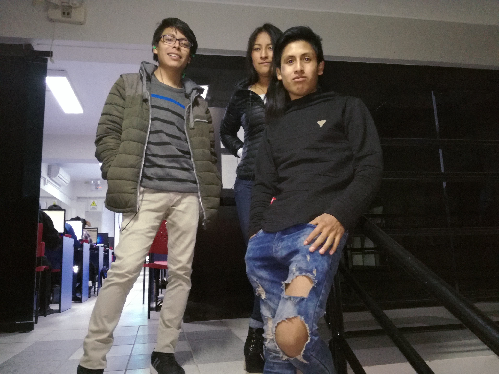

<!DOCTYPE html>
<html>
<head>
	<meta charset="utf-8" />
	<meta name = "viewport" content = "width = device-width, initial-scale = 1">
	<title>6to ciclo computación instituto continental 2019</title>
	<link rel="stylesheet" href="style.css"/>
</head>
<body>
	<header>
		<h1>RETO CUMPLIDO NO ME JALARE</h1>
	</header>
	<section>
		<article>
			
		</article>
	</section>

	<footer>
		INSTITUTO CONTINENTAL- 2019
	</footer>

</body>
</html>
